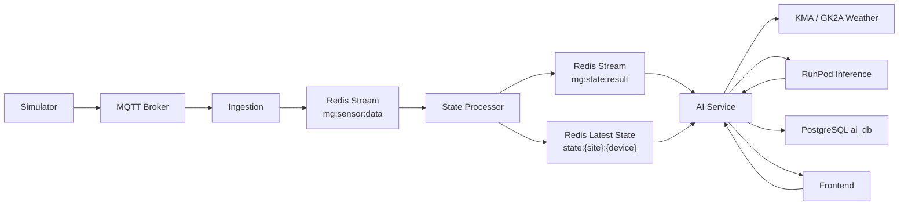

# AI Forecast Persistence and API Flow

Last updated: 2026-05-12

이 문서는 EMS AI 서비스의 forecast 입력, RunPod 추론, DB 저장, 실제값 매칭, 정확도 조회 API까지의 운영 계약을 정의한다.

## 1. 목적

AI 서비스는 제어 명령을 내리는 서비스가 아니다. AI 서비스의 책임은 예측값을 만들고, 그 결과와 입력 스냅샷을 자기 소유 DB인 `ai_db`에 저장한 뒤, 프론트와 다른 서비스가 조회할 수 있는 API를 제공하는 것이다.

핵심 목표는 다음과 같다.

| 항목 | 규정 |
| --- | --- |
| 입력 소스 | 프론트가 설비 정적값을 직접 넘기지 않는다. AI는 Redis Stream/latest state 또는 AI 서비스 내부 입력 조립 로직에서 필요한 값을 구성한다. |
| 추론 | RunPod는 모델 추론만 수행한다. EMS의 설비 상태 관리와 제어 판단은 RunPod 책임이 아니다. |
| 저장 | AI 추론 결과는 `ai_db`에 저장한다. 다른 서비스 DB를 직접 조회해서 결합하지 않는다. |
| 프론트 조회 | 프론트는 최신 예측, 실제값 매칭, 정확도 API를 통해 결과를 조회한다. |
| MSA 경계 | AI 서비스는 자기 DB인 `ai_db`만 쓴다. TimescaleDB, state/control DB 직접 조회는 금지한다. |

## 2. 전체 데이터 흐름

아래 흐름은 운영 최종 구조다. 현재 코드에 반영된 범위는 `/api/ai/forecast` 결과 DB 저장, `/api/ai/forecast/actuals` 실제값 매칭, `/api/ai/forecast/accuracy` 정확도 조회다. Redis latest state에서 AI 입력을 자동 조립하는 부분은 다음 구현 단계로 둔다.



운영 흐름은 다음 순서로 본다.

1. Simulator는 MQTT로 원시 telemetry를 보낸다.
2. Ingestion은 MQTT 메시지를 EMS 표준 envelope으로 정리해 `mg:sensor:data`에 적재한다.
3. State Processor는 1초 단위 상태를 계산하고 `mg:state:result`, `state:{site}:{device}`에 최신 상태를 유지한다.
4. AI는 forecast 주기마다 Redis Stream/latest state에서 필요한 최신 상태와 설비 스펙을 읽는다. 이 단계는 현재 설계 규정이며, 코드 연결은 후속 작업이다.
5. AI는 KMA/GK2A 등 외부 기상 데이터를 결합해 RunPod 추론 payload를 구성한다.
6. RunPod는 예측 결과를 반환한다.
7. AI는 결과를 `ai_forecast_run`, `ai_forecast_point`, `ai_inference_event`에 저장한다.
8. 실제값이 확정되면 `/api/ai/forecast/actuals`로 `ai_forecast_actual`에 매칭한다.
9. 프론트는 `/api/ai/forecast/accuracy`로 정확도 퍼센트와 오차 지표를 조회한다.

## 3. 입력 데이터 규정

### 3.1 프론트 입력 규정

프론트는 예측 요청 시 설비 정적값을 직접 넘기는 주체가 아니다.

프론트가 넘길 수 있는 값은 조회/요청 범위에 가깝다.

| 필드 | 설명 |
| --- | --- |
| `site_id` | 조회 또는 forecast 대상 site |
| `start_time` | forecast 시작 시각 |
| `periods` | forecast point 개수 |
| `frequency_hours` | point 간격 |
| `target_times` | 명시 target time 배열 |
| `net_load_high_threshold_kw` | 추천 후보 계산용 threshold |

프론트가 직접 넘기면 안 되는 값은 다음이다.

| 값 | 이유 |
| --- | --- |
| `installed_capacity_kw` | 설비 정적 스펙이며 simulator/state 쪽에서 관리되어야 한다. |
| `latitude`, `longitude`, `dong_code` | 현장/장비 메타 정보이며 프론트 입력값으로 신뢰하면 안 된다. |
| ESS `capacity_kwh`, `power_limit_kw` | 제어와 예측이 같이 쓰는 설비 스펙이다. |
| Diesel `max_capacity_kw` | 장비 스펙이며 운영자가 임의 요청마다 바꾸는 값이 아니다. |

### 3.2 Simulator telemetry 규정

Simulator는 telemetry에 `data.spec`을 포함해야 한다. 정적값을 `instantaneous`, `energy`, `status` 안에 섞지 않는다.

표준 구조:

```json
{
  "message_type": "telemetry",
  "site_id": "PLANT-ALPHA",
  "resource_id": "solar-01",
  "resource_type": "SOLAR",
  "timestamp": "2026-05-12T15:00:00+09:00",
  "data": {
    "instantaneous": {
      "P": 123.4,
      "Q": 0,
      "V": 380,
      "f": 60,
      "PF": 1
    },
    "energy": {},
    "status": {},
    "spec": {
      "installed_capacity_kw": 800.0,
      "latitude": 36.35,
      "longitude": 127.38,
      "timezone": "Asia/Seoul",
      "dong_code": "3020010100"
    }
  }
}
```

장비별 `data.spec` 권장 필드:

| resource_type | 필수/권장 spec |
| --- | --- |
| `SOLAR` | `installed_capacity_kw`, `latitude`, `longitude`, `timezone`, `dong_code` |
| `ESS` | `capacity_kwh`, `power_limit_kw`, `latitude`, `longitude`, `timezone` |
| `LOAD` | `rated_kw`, `base_kw`, `latitude`, `longitude`, `timezone` |
| `DIESEL` | `max_capacity_kw`, `latitude`, `longitude`, `timezone` |

### 3.3 Redis state 규정

State Processor는 `reported_state`와 `resource_spec`을 분리해야 한다.

예상 latest state:

```json
{
  "site_id": "PLANT-ALPHA",
  "device_id": "solar-01",
  "resource_type": "SOLAR",
  "timestamp": "2026-05-12T15:00:00+09:00",
  "reported_state": {
    "P": 123.4,
    "Q": 0,
    "V": 380,
    "f": 60,
    "PF": 1
  },
  "resource_spec": {
    "installed_capacity_kw": 800.0,
    "latitude": 36.35,
    "longitude": 127.38,
    "timezone": "Asia/Seoul",
    "dong_code": "3020010100"
  }
}
```

`reported_state`는 최근 계측 상태만 담는다. 정적 스펙은 `resource_spec`에 둔다. 이 규칙을 지키면 Control은 기존 `reported_state` 기반 로직을 유지하면서, 필요할 때만 `resource_spec`을 추가로 읽을 수 있다.

## 4. 캐싱과 주기 규정

AI forecast는 15~30분 주기로 돈다. 따라서 AI 때문에 1초마다 커지는 별도 AI feature cache를 만들면 안 된다.

규정:

| 항목 | 규정 |
| --- | --- |
| 1초 state | 최근 상태와 작고 안정적인 `resource_spec`만 유지한다. |
| 장기 이력 | TimescaleDB/db-writer 영역이다. AI가 직접 다른 DB를 조회하지 않는다. 필요한 경우 서비스 API 또는 별도 이벤트 계약을 둔다. |
| 모델 입력 feature | forecast 실행 시점에 Redis latest state, Redis Stream, 기상 API, AI 내부 기본값을 조합해 만든다. |
| 재학습 데이터 | 운영 추론 저장 DB와 학습 데이터셋은 목적을 분리한다. 추론 결과는 `ai_db`, 시계열 원천은 TimescaleDB가 담당한다. |

## 5. AI DB 환경변수 규정

AI 서비스는 기존 배포 env를 우선 사용한다.

| 설정 | 우선순위 |
| --- | --- |
| DB enabled | `S305_AI_DB_ENABLED`, 기본값 `true` |
| host | `S305_AI_DB_HOST` → `AI_DB_HOST` → `POSTGRES_HOST` |
| port | `S305_AI_DB_PORT` → `AI_DB_PORT` → `POSTGRES_PORT` |
| database | `S305_AI_DB_NAME` → `AI_DB` |
| user | `S305_AI_DB_USER` → `AI_USER` |
| password | `S305_AI_DB_PASSWORD` → `AI_DB_PASSWORD` → `AI_PASSWORD` |

CI/CD가 dev/app 별로 다음 값을 주입하면 AI 서비스는 그대로 따른다.

```env
POSTGRES_HOST=...
POSTGRES_PORT=...
AI_DB=ai_db
AI_USER=ai_user
AI_PASSWORD=...
```

DB 저장을 강제로 끄려면 실제 배포 env에 다음을 넣는다.

```env
S305_AI_DB_ENABLED=false
```

## 6. DB 테이블 정의

### 6.1 `ai_forecast_run`

forecast 실행 1회를 저장한다.

| 컬럼 | 의미 |
| --- | --- |
| `forecast_run_id` | 실행 ID |
| `site_id` | 대상 site |
| `trigger_source` | `api`, `scheduler`, `manual-test` 등 실행 출처 |
| `base_time` | forecast 기준 시각 |
| `horizon_hours` | forecast horizon |
| `model_name` | 사용 모델 또는 task 이름 |
| `model_version` | 모델 버전 |
| `runpod_endpoint_id` | RunPod endpoint id |
| `runpod_job_id` | RunPod job id. 현재 동기 호출에서는 비어 있을 수 있다. |
| `status` | `SUCCESS`, `FAILED`, `FALLBACK`, `PARTIAL` |
| `input_snapshot_json` | 핵심 입력 요약 |
| `request_payload_json` | AI forecast 요청 전체 |
| `response_payload_json` | AI forecast 응답 전체 |
| `started_at`, `completed_at`, `created_at` | 실행/저장 시각 |

### 6.2 `ai_forecast_point`

forecast 결과의 시간대별 point를 저장한다. `forecasts` 배열 1개 row가 1개 point다.

| 컬럼 | 의미 |
| --- | --- |
| `forecast_point_id` | point ID |
| `forecast_run_id` | 실행 ID FK |
| `site_id` | 대상 site |
| `target_time` | 예측 대상 시각 |
| `horizon_step` | horizon index |
| `predicted_solar_kw` | 태양광 예측 kW |
| `predicted_load_kw` | 부하 예측 kW |
| `predicted_net_load_kw` | 순부하 예측 kW |
| `confidence` | 신뢰도. 없으면 null |
| `raw_output_json` | point 원본 JSON |

### 6.3 `ai_forecast_actual`

예측 point에 실제값을 매칭한다. 정확도 검증의 기준 테이블이다.

| 컬럼 | 의미 |
| --- | --- |
| `forecast_point_id` | 예측 point ID. PK/FK |
| `actual_time` | 실제값 기준 시각 |
| `actual_solar_kw` | 실제 태양광 발전량 |
| `actual_load_kw` | 실제 부하 |
| `actual_net_load_kw` | 실제 순부하 |
| `actual_source` | 실제값 출처. 예: `timescale.sensor_data_1m`, `redis.state`, `manual` |
| `raw_actual_json` | 실제값 원본 JSON |
| `matched_at` | 매칭 저장 시각 |

`actual_net_load_kw`가 payload에 없고 `actual_load_kw`, `actual_solar_kw`가 있으면 AI 서비스가 `actual_load_kw - actual_solar_kw`로 계산한다.

### 6.4 `ai_inference_event`

추론 처리 중 발생한 이벤트 로그를 저장한다.

| 컬럼 | 의미 |
| --- | --- |
| `event_id` | 이벤트 ID |
| `forecast_run_id` | 관련 forecast run. 없을 수 있다. |
| `event_type` | 이벤트 유형 |
| `message` | 사람이 읽는 메시지 |
| `payload_json` | 상세 JSON |
| `created_at` | 발생 시각 |

현재 코드가 남기는 이벤트:

| event_type | 발생 조건 |
| --- | --- |
| `FORECAST_SAVED` | `/api/ai/forecast` 결과 저장 성공 |
| `FORECAST_SAVE_FAILED` | forecast 저장 실패 시 best-effort 기록 |
| `ACTUAL_MATCHED` | 실제값이 forecast point와 매칭됨 |

## 7. API 정의

### 7.1 `POST /api/ai/forecast`

통합 forecast를 실행하고 결과를 DB에 저장한다.

요청 예시:

```json
{
  "site_id": "PLANT-ALPHA",
  "start_time": "2026-05-12T15:00:00+09:00",
  "periods": 24,
  "frequency_hours": 1,
  "site": {
    "site_id": "PLANT-ALPHA",
    "latitude": 36.35,
    "longitude": 127.38,
    "timezone": "Asia/Seoul",
    "installed_capacity_kw": 800.0,
    "base_load_kw": 300.0
  }
}
```

운영 최종형에서는 `site` 내부 스펙을 프론트가 주지 않고 AI가 Redis latest state에서 조립한다. 위 예시는 API 형태 설명용이다.

응답 핵심:

```json
{
  "ok": true,
  "task": "forecast",
  "rows": 24,
  "forecast_run_id": "4af4b1d8-...",
  "persistence": {
    "enabled": true,
    "saved": true,
    "forecast_run_id": "4af4b1d8-..."
  },
  "forecasts": [
    {
      "target_time": "2026-05-12T15:00:00+09:00",
      "site_id": "PLANT-ALPHA",
      "predicted_solar_kw": 123.4,
      "predicted_load_kw": 300.0,
      "predicted_net_load_kw": 176.6
    }
  ]
}
```

저장 실패 시 API 응답 자체는 실패시키지 않고 다음처럼 노출한다.

```json
{
  "persistence": {
    "enabled": true,
    "saved": false,
    "error": "..."
  }
}
```

### 7.2 `POST /api/ai/forecast/actuals`

예측 point에 실제값을 매칭한다.

요청 예시:

```json
{
  "site_id": "PLANT-ALPHA",
  "actual_source": "timescale.sensor_data_1m",
  "actuals": [
    {
      "target_time": "2026-05-12T15:00:00+09:00",
      "actual_solar_kw": 100.0,
      "actual_load_kw": 330.0
    }
  ]
}
```

`forecast_run_id`를 같이 주면 특정 forecast 실행 결과에만 매칭한다.

응답:

```json
{
  "ok": true,
  "task": "forecast_actuals",
  "enabled": true,
  "matched": 1,
  "skipped": 0,
  "errors": []
}
```

매칭 기준:

| 기준 | 설명 |
| --- | --- |
| 기본 | `site_id + target_time` |
| 선택 | `forecast_run_id + site_id + target_time` |
| 중복 | 같은 `forecast_point_id`는 upsert |
| 실패 | point가 없으면 `skipped` 증가, `errors`에 사유 기록 |

### 7.3 `GET /api/ai/forecast/accuracy`

예측값과 실제값의 오차/정확도를 조회한다.

Query:

| 파라미터 | 설명 |
| --- | --- |
| `site_id` | site 필터 |
| `forecast_run_id` | 특정 forecast 실행 필터 |
| `from_time` | target_time 시작 |
| `to_time` | target_time 종료 |
| `limit` | 반환 row 수. 기본 100, 최대 1000 |
| `min_denominator_kw` | 정확도 산식 분모 하한. 기본 1.0 |

예시:

```text
GET /api/ai/forecast/accuracy?site_id=PLANT-ALPHA&limit=50
```

응답:

```json
{
  "ok": true,
  "task": "forecast_accuracy",
  "enabled": true,
  "summary": {
    "matched_points": 10,
    "overall_accuracy_percent": 91.2,
    "solar": {
      "count": 10,
      "accuracy_percent": 89.5,
      "mae_kw": 12.3,
      "mape_percent": 10.5,
      "bias_kw": -2.1
    },
    "load": {
      "count": 10,
      "accuracy_percent": 93.4,
      "mae_kw": 15.8,
      "mape_percent": 6.6,
      "bias_kw": 3.0
    },
    "net_load": {
      "count": 10,
      "accuracy_percent": 90.7,
      "mae_kw": 18.1,
      "mape_percent": 9.3,
      "bias_kw": 1.4
    }
  },
  "rows": [
    {
      "forecast_run_id": "4af4b1d8-...",
      "forecast_point_id": 1,
      "site_id": "PLANT-ALPHA",
      "target_time": "2026-05-12T15:00:00+09:00",
      "overall_accuracy_percent": 91.2,
      "solar": {
        "predicted_kw": 123.4,
        "actual_kw": 100.0,
        "error_kw": -23.4,
        "absolute_error_kw": 23.4,
        "absolute_percentage_error_percent": 23.4,
        "accuracy_percent": 76.6
      }
    }
  ]
}
```

정확도 산식:

```text
error_kw = actual_kw - predicted_kw
absolute_error_kw = abs(error_kw)
absolute_percentage_error_percent = absolute_error_kw / max(abs(actual_kw), min_denominator_kw) * 100
accuracy_percent = clamp(100 - absolute_percentage_error_percent, 0, 100)
```

`summary.*.mae_kw`는 평균 절대 오차, `summary.*.mape_percent`는 평균 절대 백분율 오차, `summary.*.bias_kw`는 평균 signed error다.

## 8. 프론트 연동 규정

프론트는 다음 순서로 연동한다.

| 화면/기능 | 호출 API |
| --- | --- |
| forecast 실행 또는 수동 테스트 | `POST /api/ai/forecast` |
| 최신 예측 결과 표시 | 현재는 `POST /forecast` 응답 사용. 추후 latest 조회 API를 별도 추가 가능 |
| 실제값 매칭 배치/수동 검증 | `POST /api/ai/forecast/actuals` |
| 정확도 카드/차트 | `GET /api/ai/forecast/accuracy` |

프론트 표시 권장 지표:

| 지표 | API 필드 |
| --- | --- |
| 전체 정확도 | `summary.overall_accuracy_percent` |
| 태양광 정확도 | `summary.solar.accuracy_percent` |
| 부하 정확도 | `summary.load.accuracy_percent` |
| 순부하 정확도 | `summary.net_load.accuracy_percent` |
| 평균 오차 | `summary.*.mae_kw` |
| 편향 | `summary.*.bias_kw` |

## 9. MSA 경계 규정

금지:

- AI 서비스가 TimescaleDB를 직접 조회해 1분/1시간 시계열을 가져오는 것
- AI 서비스가 State/Control DB를 직접 조회하는 것
- 프론트가 설비 스펙을 매 요청마다 직접 넘겨 AI 입력을 결정하는 것
- 15~30분 forecast 때문에 1초 state stream에 대량 AI feature를 추가하는 것

허용:

- State Processor가 latest state에 작은 `resource_spec`을 유지하는 것
- AI가 자기 DB `ai_db`에 추론 결과와 정확도 검증 결과를 저장하는 것
- 실제값 매칭을 별도 API나 배치로 AI 서비스에 요청하는 것
- 추후 필요한 경우 db-writer나 state 계열 서비스가 AI용 summary event/API를 제공하는 것

## 10. 운영 확인 쿼리

최근 forecast 저장 확인:

```sql
SELECT forecast_run_id, site_id, trigger_source, status, created_at
FROM public.ai_forecast_run
ORDER BY created_at DESC
LIMIT 10;
```

forecast point 확인:

```sql
SELECT forecast_point_id, forecast_run_id, site_id, target_time,
       predicted_solar_kw, predicted_load_kw, predicted_net_load_kw
FROM public.ai_forecast_point
ORDER BY created_at DESC
LIMIT 20;
```

실제값 매칭 확인:

```sql
SELECT p.site_id, p.target_time,
       p.predicted_solar_kw, a.actual_solar_kw,
       p.predicted_load_kw, a.actual_load_kw,
       p.predicted_net_load_kw, a.actual_net_load_kw,
       a.actual_source, a.matched_at
FROM public.ai_forecast_actual a
JOIN public.ai_forecast_point p
  ON p.forecast_point_id = a.forecast_point_id
ORDER BY a.matched_at DESC
LIMIT 20;
```

이벤트 확인:

```sql
SELECT event_type, message, forecast_run_id, created_at
FROM public.ai_inference_event
ORDER BY created_at DESC
LIMIT 20;
```

## 11. 배포 확인

AI 이미지에는 PostgreSQL 접속을 위해 `psycopg[binary]`가 설치되어야 한다.

컨테이너 확인:

```bash
docker exec dev-ai-1 python -c "import psycopg; print('psycopg ok')"
```

배포 후 `/api/ai/forecast` 응답에서 다음을 확인한다.

```json
{
  "persistence": {
    "enabled": true,
    "saved": true
  }
}
```

`saved=false`면 `persistence.error`를 먼저 확인한다. DB 접속 env, 테이블 존재 여부, 권한, 네트워크 순서로 점검한다.
